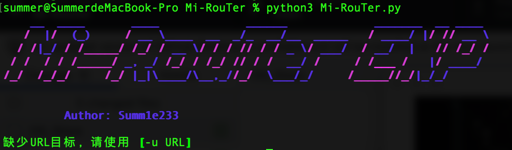
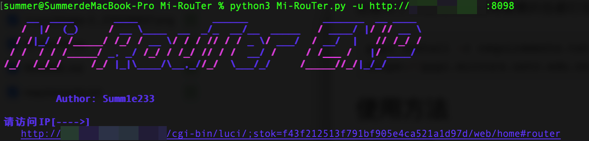

# Mi-RouTer

## 自我介绍

我们是来自一支五湖四海的信息安全爱好者，喜爱CTF、渗透、内网渗透，只为学习发声，一起共勉吧！


## 安装

这里为了方便同学们我将需要的包都打包在-->requirements.txt

```python
pip3 install -r requirements.txt -i https://pypi.mirrors.ustc.edu.cn/simple/
```

## 使用方法

正常使用工具



-u http://ip/8888



将url复制到浏览器当中就ok了


